# Both Sides

### When your sources disagree, see both sides before you pick one.

[](https://both-sides-eta.vercel.app)
[](https://nextjs.org)
[](https://www.typescriptlang.org)
[](https://tailwindcss.com)
[](https://www.sanity.io)
[](https://neon.tech)
[](/mcp.json)
[](LICENSE)

**[Live app](https://both-sides-eta.vercel.app)** ·
**[GitHub](https://github.com/aniruddhaadak80/both-sides)** ·
**[API](https://both-sides-eta.vercel.app/api/health)** ·
**[Agent](https://both-sides-eta.vercel.app/agent)** ·
**[Issues](https://github.com/aniruddhaadak80/both-sides/issues)**

---

Structured knowledge bases contradict themselves constantly. One Wikidata entity
carries **35 different population claims**; another carries **three different
founding dates** for the same city. A naive system picks one silently and is
confidently wrong.

Both Sides is an adjudication desk. It loads a real entity, puts every competing
claim side by side **with its references**, and rules on which one governs using
an explainable, deterministic precedence engine. The ruling is sealed into a
SHA-384 hash chain so anyone can replay it and prove nothing was edited.

- **Project id:** `4npxmu4m` · **Dataset:** `production`
- **Data:** Wikidata (CC0 1.0), Wikipedia (CC BY-SA 4.0), OpenStreetMap (ODbL) — all key-free
- **No accounts, no API keys, no signup**

---

## Screens

**The landing page shows a real contradiction, not a mock.** Reykjavík's population
carries 45 published claims; the engine ranks them and shows the sentence behind
every factor.

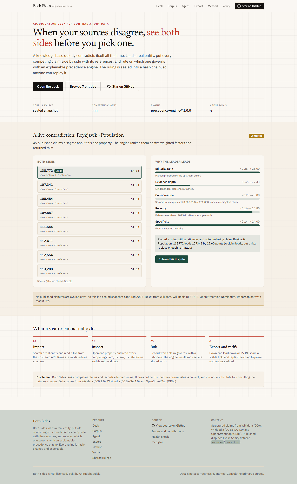

**The adjudication desk.** Both sides are permanently on screen with the winning
claim marked, and every claim's upstream rank and reference count.

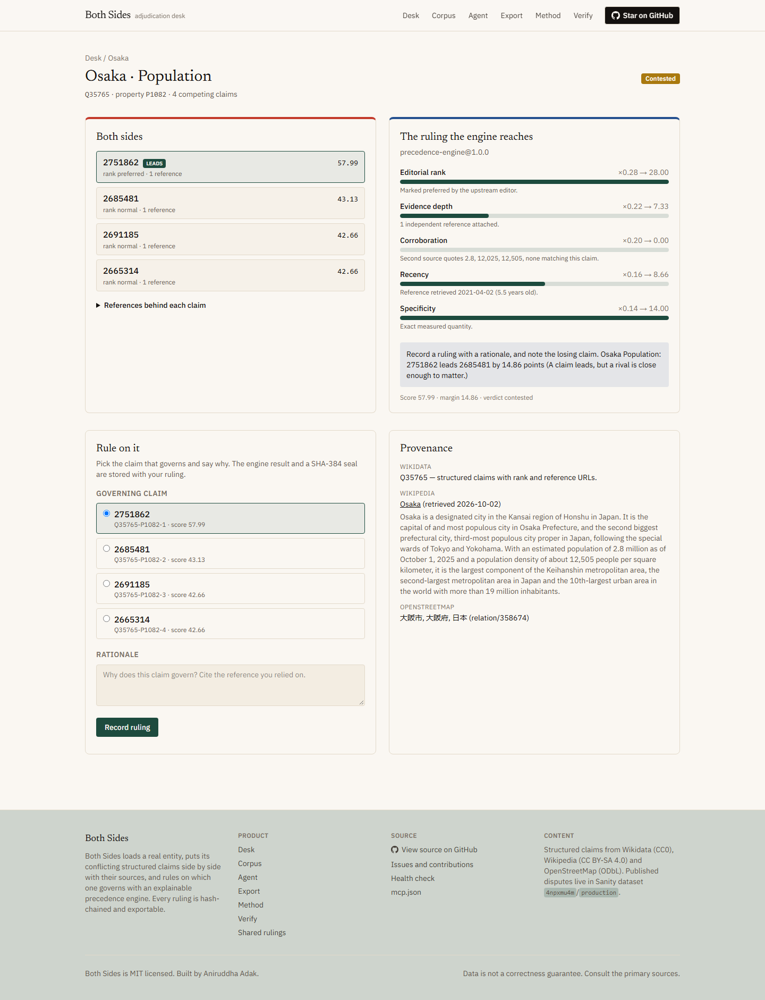

**Recording a ruling** through the visible control, with the seal reported back.

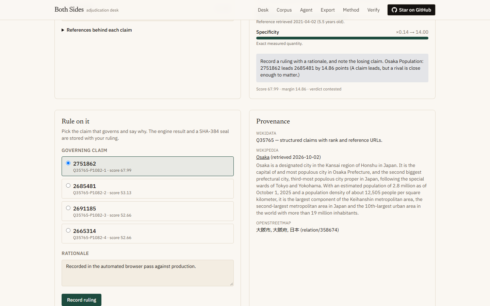

**The agent console** issues real JSON-RPC calls and shows the request and the
response side by side.

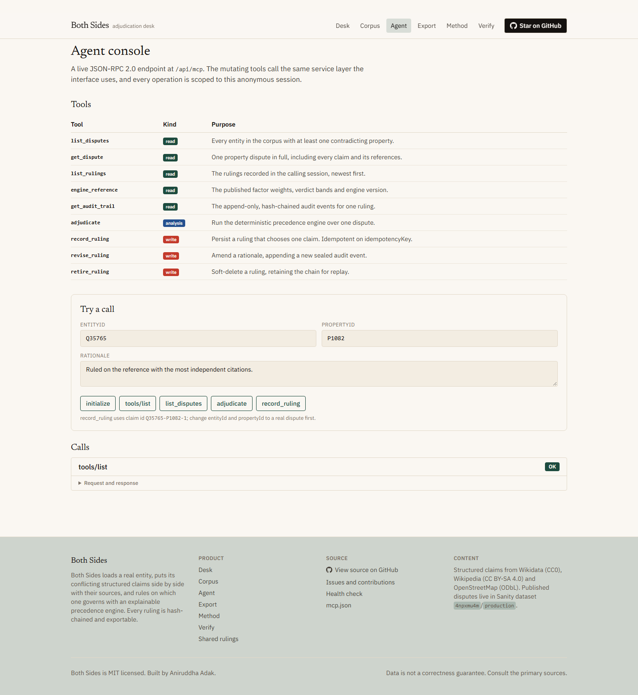

**The corpus**, every entity and disputed property with its claims.

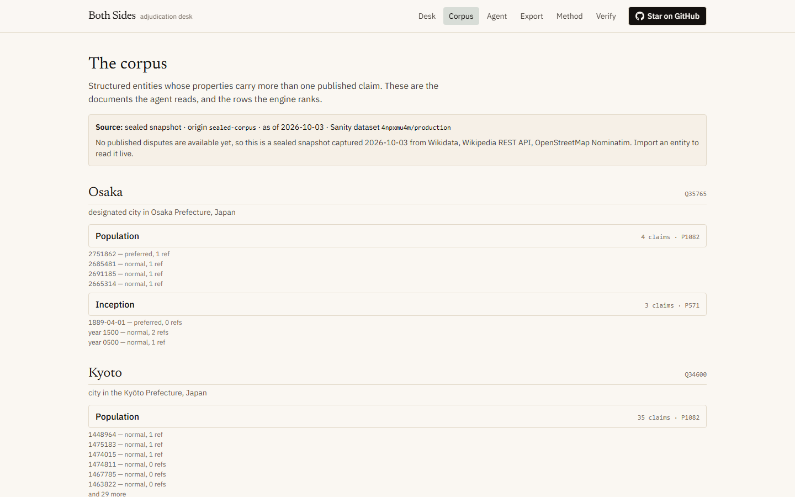

**Mobile**, including the navigation drawer with the repository link.

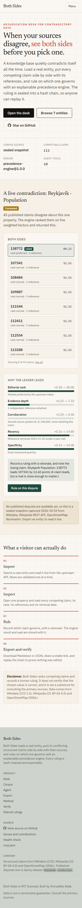

---

## Contents

- [✨ Features](#-features)
- [🚀 Quickstart](#-quickstart)
- [🔌 API](#-api)
- [🤖 Agent](#-agent)
- [🧮 The engine](#-the-engine)
- [🔐 Integrity](#-integrity)
- [📁 Project map](#-project-map)
- [🏗 Architecture](#-architecture)
- [📊 Data provenance](#-data-provenance)
- [🛡 Security model](#-security-model)
- [🚢 Deployment](#-deployment)
- [🗺 Roadmap](#-roadmap)
- [🤝 Contributing](#-contributing)
---

## ✨ Features

| You want to… | What Both Sides does |
| --- | --- |
| See whether a fact is actually settled | Loads the entity and shows **every** published claim for a property, with rank, references and retrieval date |
| Understand *why* one claim wins | Five weighted factors, each showing the sentence and the number that produced its contribution |
| Catch a silent upstream rejection | A `deprecated` claim is **barred from governing**, no matter how many references it carries |
| Record a decision others can check | Your ruling, its rationale, the engine result and a SHA-384 seal are stored together |
| Prove nothing was edited later | Replay recomputes every seal and names the first broken link |
| Let an agent do it | 9 MCP tools, 3 of which mutate through the same service layer the UI uses |
| Hand a colleague the result | Markdown or JSON export carrying provenance and the chain, plus a stable share link |
| Ship your own copy | Zero required environment variables locally; hosted Postgres in production |

---

## 🚀 Quickstart

```bash
git clone https://github.com/aniruddhaadak80/both-sides.git
cd both-sides/web
npm install
npm run dev
```

Open <http://localhost:3000>. **That is the whole setup.** With no environment
variables at all, the app runs against an embedded PGlite database and a sealed
offline corpus, so the first paint never breaks and the build never needs the
network.

### Scripts

| Script | What it does |
| --- | --- |
| `npm run dev` | Development server |
| `npm run typecheck` | `tsc --noEmit` |
| `npm run lint` | ESLint |
| `npm run test` | Deterministic unit tests (`node:test`) |
| `npm run build` | Production build |
| `npm run verify:live` | 76-check end-to-end HTTP journey against `BASE_URL` |
| `npm run smoke` | Boots the app locally, runs the journey, shuts down |
| `npm run corpus` | Re-captures the sealed corpus from upstream |

### The Studio (separate package)

```bash
cd ../studio
npm install
npm run dev          # standalone Studio
npm run schema:deploy  # push the schema to the Content Lake
```

The Studio is deliberately **not** embedded in the Next.js app.

### Production environment variables

Documented with no values in [`.env.example`](.env.example):

| Variable | Required | Purpose |
| --- | --- | --- |
| `DATABASE_URL` | **yes in production** | Hosted Postgres. The app **refuses to start** without it in production, because a serverless filesystem is not durable. |
| `NEXT_PUBLIC_SANITY_PROJECT_ID` | no | Defaults to `4npxmu4m` |
| `NEXT_PUBLIC_SANITY_DATASET` | no | Defaults to `production` |
| `SANITY_API_READ_TOKEN` | no | Only if you make the dataset private |
| `SANITY_API_WRITE_TOKEN` | no | Only to seed the Content Lake from a script |
| `NEXT_PUBLIC_SITE_URL` | no | Canonical URL for metadata |
| `PGLITE_DIR` | no | Opt-in file-backed local database |

---

## 🔌 API

Every response is JSON. Errors use one envelope:

```json
{ "error": { "code": "not_found", "message": "Entity Q1 is not available." } }
```

### Health

```bash
curl -s https://both-sides-eta.vercel.app/api/health
```

```json
{
  "status": "ok",
  "engineVersion": "precedence-engine@1.0.0",
  "persistence": { "store": "neon-postgres", "reachable": true },
  "sanity": {
    "projectId": "4npxmu4m",
    "dataset": "production",
    "reachable": true,
    "publishedDisputes": 0
  }
}
```

### Browse the corpus

```bash
curl -s https://both-sides-eta.vercel.app/api/corpus | head -c 400
```

### Import a real entity, then read it back

```bash
# 1. search upstream
curl -s "https://both-sides-eta.vercel.app/api/entities?q=Reykjavik"

# 2. import it (stored for your anonymous session)
curl -s -X POST https://both-sides-eta.vercel.app/api/entities \
  -H 'content-type: application/json' \
  -c jar.txt -b jar.txt \
  -d '{"entityId":"Q1764"}'

# 3. run the engine over one property
curl -s -X POST https://both-sides-eta.vercel.app/api/adjudicate \
  -H 'content-type: application/json' \
  -c jar.txt -b jar.txt \
  -d '{"entityId":"Q1764","propertyId":"P1082"}'
```

### Record a ruling, then verify it survived

```bash
# create
curl -s -X POST https://both-sides-eta.vercel.app/api/rulings \
  -H 'content-type: application/json' -c jar.txt -b jar.txt \
  -d '{
    "entityId":"Q1764",
    "propertyId":"P1082",
    "chosenClaimId":"Q1764-P1082-1",
    "rationale":"Preferred rank, three references, corroborated by the encyclopedia extract.",
    "idempotencyKey":"demo-1"
  }'

# read back
curl -s https://both-sides-eta.vercel.app/api/rulings -b jar.txt

# update
curl -s -X PATCH https://both-sides-eta.vercel.app/api/rulings/<id> \
  -H 'content-type: application/json' -b jar.txt \
  -d '{"rationale":"Amended: the third reference was retracted upstream."}'

# export
curl -s "https://both-sides-eta.vercel.app/api/export?id=<id>&format=markdown" -o ruling.md
```

| Method | Route | Purpose |
| --- | --- | --- |
| `GET` | `/api/health` | Real datastore and Content Lake check |
| `GET` | `/api/session` | Mint the anonymous scope cookie |
| `GET` | `/api/corpus` | Entities, disputes and provenance |
| `GET` | `/api/entities?q=` | Search upstream |
| `POST` | `/api/entities` | Import an entity live |
| `DELETE` | `/api/entities/{entityId}` | Remove an import |
| `POST` | `/api/adjudicate` | Run the precedence engine |
| `GET` `POST` | `/api/rulings` | List / create rulings |
| `GET` `PATCH` `DELETE` | `/api/rulings/{id}` | Read / amend / soft-delete |
| `GET` | `/api/rulings/{id}/replay` | Recompute the chain |
| `GET` | `/api/export?id=&format=` | Markdown or JSON dossier |
| `POST` | `/api/mcp` | JSON-RPC 2.0 agent endpoint |

---

## 🤖 Agent

A live JSON-RPC 2.0 endpoint, also published as
[`public/mcp.json`](web/public/mcp.json):

```json
{
  "mcpServers": {
    "both-sides": {
      "type": "http",
      "url": "https://both-sides-eta.vercel.app/api/mcp"
    }
  }
}
```

| Tool | Kind | Purpose |
| --- | --- | --- |
| `list_disputes` | read | Every entity with a contradicting property |
| `get_dispute` | read | One dispute in full, with every reference |
| `list_rulings` | read | Rulings in the calling session |
| `engine_reference` | read | Published weights and verdict bands |
| `get_audit_trail` | read | Hash-chained events for one ruling |
| `adjudicate` | analysis | Runs the shared precedence engine |
| `record_ruling` | **write** | Persists a ruling, idempotent on `idempotencyKey` |
| `revise_ruling` | **write** | Amends a rationale, appending a sealed event |
| `retire_ruling` | **write** | Soft-delete, retaining the chain |

```bash
curl -s -X POST https://both-sides-eta.vercel.app/api/mcp \
  -H 'content-type: application/json' \
  -d '{"jsonrpc":"2.0","id":1,"method":"tools/list"}'
```

Retrying `record_ruling` with the same `idempotencyKey` returns the original
ruling and `idempotentReplay: true` — it does not create a duplicate. Every tool
is scoped to the calling anonymous session, so an agent cannot read or mutate
anyone else's rulings.

---

## 🧮 The engine

`precedence-engine@1.0.0` — deterministic, versioned, and the **same function**
backs the interface, the REST endpoint and the agent tool.

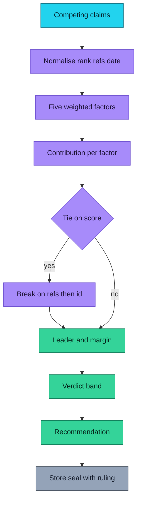

| Factor | Weight | Measures |
| --- | --- | --- |
| `editorialRank` | 0.28 | Upstream preference: preferred / normal / deprecated |
| `evidenceDepth` | 0.22 | How many independent references back it |
| `corroboration` | 0.20 | Whether the second source quotes a matching figure |
| `recency` | 0.16 | Reference age, decaying over 12 years |
| `specificity` | 0.14 | Precise measurement versus a vague band |

Weights sum to exactly `1`, and the unit tests assert it.

| Verdict | Margin | Required action |
| --- | --- | --- |
| `settled` | ≥ 18 | Rely on the leader and cite its references |
| `contested` | ≥ 8 | Record a ruling and note the losing claim |
| `unresolved` | < 8 | Rely on nothing; report both and escalate |

**Two rules the engine will not bend:** a `deprecated` claim cannot govern while
an active claim exists, and exact ties break on reference count then claim id,
so two runs on identical input always produce identical output.

---

## 🔐 Integrity

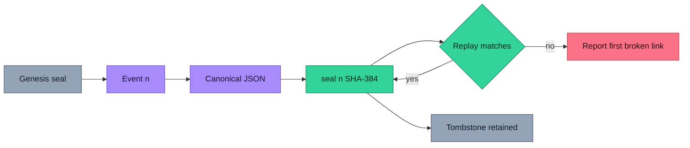

```text
seal_0 = SHA-384("both-sides/genesis/v1:" + scopeId)
seal_n = SHA-384( UTF-8(seal_{n-1}) || canonicalJson(event_n) )
```

Canonical JSON sorts object keys recursively and drops `undefined` members, so
two structurally equal payloads always hash to the same digest. Deleting a
ruling leaves a tombstone, so a replay still succeeds after a removal — verified
by the end-to-end run.

---

## 📁 Project map

```
both-sides/
├── studio/                      standalone Sanity Studio (not embedded)
│   ├── sanity.config.ts         project 4npxmu4m / dataset production
│   └── schemaTypes/             entity · dispute · claim · agent context
└── web/
    ├── public/mcp.json          agent manifest with the live endpoint
    ├── scripts/
    │   ├── capture-corpus.mjs   re-capture the sealed corpus from upstream
    │   ├── verify.mjs           76-check end-to-end journey
    │   └── smoke-local.mjs      boot, verify, shut down
    └── src/
        ├── app/
        │   ├── page.tsx                 landing with a real contradiction
        │   ├── desk/                    workspace: import, dispute list, rulings
        │   ├── dispute/[entityId]/[propertyId]/   the adjudication desk
        │   ├── corpus/                  every entity and disputed property
        │   ├── agent/                   MCP console with live request/response
        │   ├── export/                  Markdown and JSON dossiers
        │   ├── method/                  weights, bands and the seal rule
        │   ├── verify/                  integrity replay
        │   ├── settings/                what this deployment is connected to
        │   ├── share/ · share/[token]/  stable read-only ruling links
        │   └── api/
        │       ├── health · session · corpus · entities · adjudicate
        │       ├── rulings/ · rulings/[id]/ · rulings/[id]/replay
        │       ├── export/ · mcp/
        ├── components/          header, footer, verdict panel, forms, console
        └── lib/
            ├── engine.ts        precedence-engine@1.0.0
            ├── canonical.ts     canonical JSON + SHA-384 chain
            ├── repository.ts    the one service layer for every mutation
            ├── db.ts            hosted and embedded adapters
            ├── upstream.ts      Wikidata / Wikipedia / OSM reads
            ├── corpus.ts        Content Lake → import → sealed fallback
            ├── session.ts       anonymous ownership
            └── types.ts         normalised domain types
```

---

## 🏗 Architecture

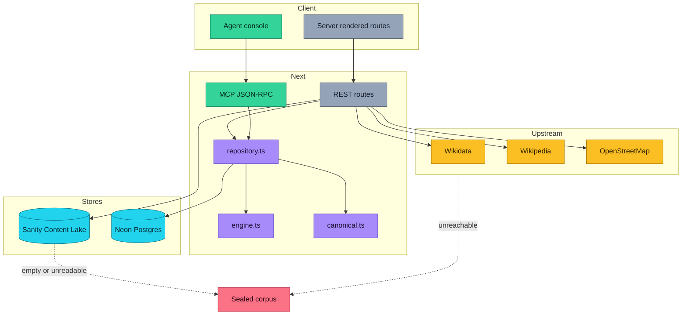

### Data pipeline and fallback

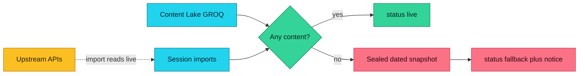

Fallback is always labelled. The envelope reports `status: "live" | "fallback"`,
`origin`, and `fetchedAt`, and the interface says which one answered.
**User-created rulings are never replaced by fallback data.**

---

## 📊 Data provenance

| Source | Used for | Licence | Key needed |
| --- | --- | --- | --- |
| [Wikidata](https://www.wikidata.org) | Structured claims, ranks, reference URLs, retrieval dates | CC0 1.0 | no |
| [Wikipedia](https://en.wikipedia.org) | Corroborating prose and figures | CC BY-SA 4.0 | no |
| [OpenStreetMap](https://www.openstreetmap.org) | Second corroborating source | ODbL | no |
| [Sanity Content Lake](https://www.sanity.io) | Curated disputes and the agent context | your dataset | no (public dataset) |

**Current state, stated plainly.** The Content Lake dataset `4npxmu4m/production`
exists and is reachable, but **no dispute documents have been published to it
yet**, so `/api/corpus` currently serves the sealed snapshot and labels itself
`fallback`. Seeding needs a write token:

```bash
cd studio
npx sanity login
npx sanity schemas deploy
SANITY_API_WRITE_TOKEN=<your editor token> node scripts/seed.mjs
```

The import path is genuinely live today: importing an entity reads Wikidata,
Wikipedia and OSM at request time and returns `status: "live"`.

---

## 🛡 Security model

- **No accounts.** A 128-bit random scope id lives in an HTTP-only, `SameSite=Lax`
  cookie. Every ruling, import and audit query filters on it; a cross-session read
  returns `404`, never someone else's data.
- **No secrets in the client.** Read and write tokens are read only in server
  modules and never use a `NEXT_PUBLIC_` prefix. The manifest at `/mcp.json`
  contains a public URL and nothing else.
- **Bounded input.** Strings are length-capped, `entityId` must match `^Q\d+$`,
  and every statement is parameterised.
- **No raw HTML.** All interpolated values are plain React text; the project
  contains no `dangerouslySetInnerHTML`.
- **Rate limiting is best-effort.** Anonymous writes are bounded by input limits
  and payload size only. On serverless, IP-based limiting can be bypassed; a
  deployment expecting sustained abuse should front the write routes with a
  hosted limiter. This is documented rather than implied.

---

## 🚢 Deployment

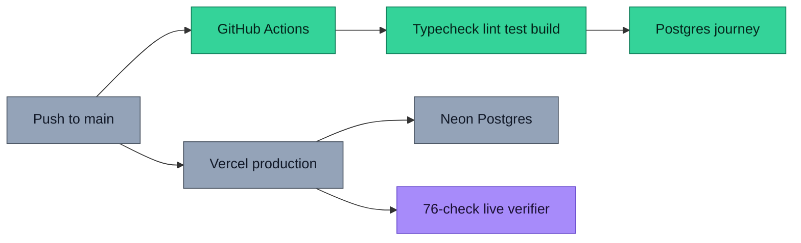

Production is Vercel with Neon Postgres. The app creates its tables on first
request using idempotent DDL, one statement at a time, so it needs no migration
step to boot.

---

## 🗺 Roadmap

### Now

- [x] Adjudication desk over live, key-free structured sources
- [x] Deterministic precedence engine with itemised factors
- [x] Hash-chained rulings with replay and tombstones
- [x] MCP agent endpoint with idempotent mutations
- [x] Markdown and JSON exports with provenance

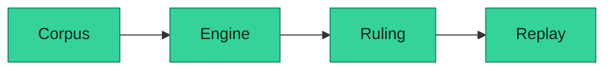

### Next

- [ ] **Publish the first curated disputes to the Content Lake** so `/api/corpus`
      serves `live` by default instead of the sealed snapshot
- [ ] **Semantic claim grouping** so near-identical values are clustered rather
      than listed, which matters when one property carries 35 claims
- [ ] **Supersede flow in the interface** — a second ruling should visibly retire
      the first, currently only reachable through the API
- [ ] **Bulk import** with per-row validation, so a whole region can be loaded at once

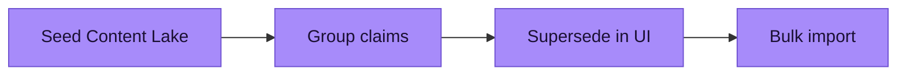

### Later

- [ ] **Agent memory of past rulings** so a settled question is not re-litigated
- [ ] **Signed exports** so a dossier carries a signature, not only a chain
- [ ] **Write-back to the Content Lake** from a ruling, turning decisions into
      structured content an agent can read next time
- [ ] **Datasets beyond places**: species, editions, firmware versions, where
      contradictions are just as real and harder to spot

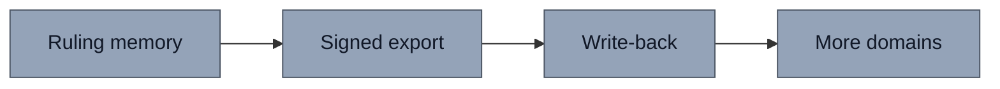

---

## ⚠️ Disclaimer

Both Sides **ranks competing claims and records a human decision**. It does not
certify that the chosen value is correct, and a high score is not a correctness
guarantee. Rupture-free, evidence-first, still not an oracle. Verify against the
primary sources before relying on any ruling.

---

## 🤝 Contributing

Issues and pull requests are welcome — see [CONTRIBUTING.md](CONTRIBUTING.md)
for the checks a change must pass and the five things that get rejected
(a score that cannot be reproduced, a claim without a source, a silent fallback,
a mutation that skips the service layer, a destructive delete).

Security issues: see [SECURITY.md](SECURITY.md). Please do not open a public
issue.

## Licence

[MIT](LICENSE) © 2026 Aniruddha Adak

Data courtesy of [Wikidata](https://www.wikidata.org) (CC0 1.0),
[Wikipedia](https://en.wikipedia.org) (CC BY-SA 4.0) and
[OpenStreetMap](https://www.openstreetmap.org) (ODbL). This project is a
participant in the [Sanity Challenge](https://dev.to/challenges/sanity-2026-09-16).